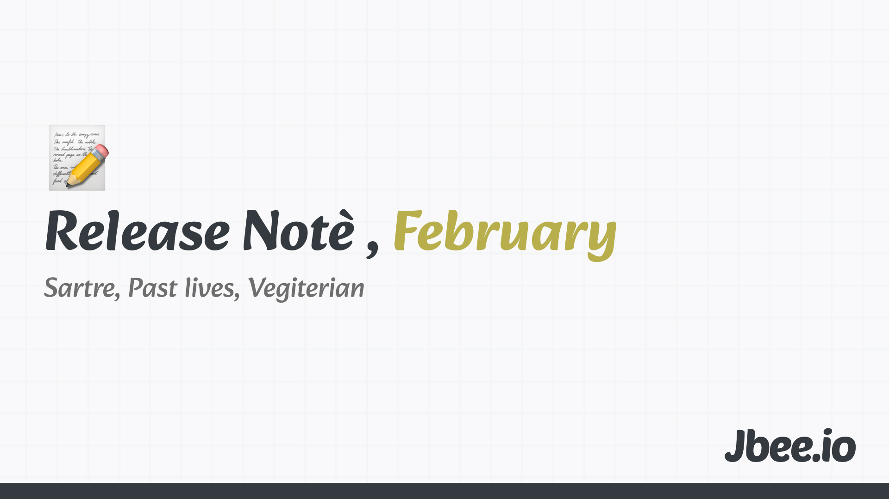
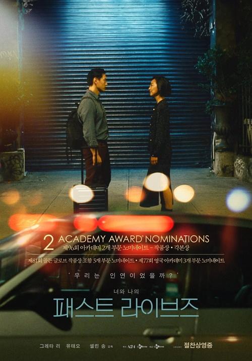

## 두번째 달, (2/12)

> 2월은 February. 고대 로마에선 Februa라는 정화 의식이 2월에 열렸다. 2월은 정화의 달이 되면서 February가 되었다.

작년 2월 회고를 보니 이 맘 때 즈음 실리콘밸리라는 목표를 잡았다. 1달 1러닝으로는 '보험'에 대해 공부했으며 Mature Engineering에 대한 여러 글을 읽고 정리했다. 다른 건 몰라도 Mature라는 단어가 마음에 들었었다. 시니어라는 단어는 왠지 모르게 거부감이 들었기 때문이다. 다시 읽어보니 1년이 지난 지금도 옳은 내용 뿐이라 블로그 글로 정리할 예정이다.

이번 달도 역시나 영어 공부는 꾸준히 하고 있다. 어느 정도 늘었으려나? 화상 영어에서 말하는 정도가 조금씩 늘어나고 있는 것 같다. 일을 시작하게 되면서 연습에 투자하는 절대적인 시간은 줄어들었다. 꾸준히 하는 것이 중요하다는 생각으로 꾸역 꾸역 해나간다.

### 2월의 철학자, 사르트르

> 인간의 존재와 자유

2월은 개인적으로 조금 불안했던 시기였다. 여러 불확실성 속에서 지내야 했다. 그리고 철학으로부터 위안을 받았다. 개인적인 불만에 대해서도 인식을 전환할 수 있게 되었다. 여러모로 많은 도움을 받은 철학이다. 무언가를 공부함으로써 위로를 받을 수 있는 분야가 아닐까.

[Jean-Paul Sartre](https://jbee.io/articles/philosophy/Jean-Paul%20Sartre)

### 2월의 영화, 패스트 라이브즈

> 우리는 인연일까

보려고 찜해둔 영화를 하나씩 꺼내 보고 있다. 그 중엔 다시 보는 영화도 있고 다시 찾아보는 영화도 있다. 이번 달엔 인터스텔라, 마션 그리고 패스트 라이브즈를 봤는데, 인상깊게 본 패스트 라이브즈에 대해 짧게 감상을 남긴다.

굳이 한 씬(Scene)만 골라 감상을 남긴다면 마지막 씬을 고르고 싶다. 일부러 포스터도 이 씬의 포스터를 골랐다. 오랜 기간 끝에 두 주인공이 만났고 마지막 날, 노라가 태성의 귀국을 배웅하기 위해 우버 탑승지까지 데려다 준다. 둘은 우버를 기다리면서 마주보고 아무 말도 하지 않는다. 어떤 말이 나올까 조마조마 하던 찰나에 우버가 도착한다. 꽤 오랜 시간 아무 대화가 오고 가지 않았지만 그 순간 두 사람의 감정에 푹 빠졌다. 복잡하고 미묘한 감정을 적당한 시간의 침묵으로 표현했다. 오히려 아무 대사가 없기에 두 사람의 감정 속으로 들어갈 수 있지 않았을까 싶다. 공백으로도 많은 것을 표현하고 전달받을 수 있다. 공백이었기에 더 많은 것을 전달할 수 있었을 것이다. 실제로 셀린 송 감독은 연극을 오래해서 침묵의 힘을 알고 이를 사용했다고 한다.

삶에 여유가 필요한 이유가 아닐까. 새로운 행운이 찾아오려면 빈 공간도 있어야 하지 않을까. 테트리스 하듯 시간을 쪼개어 끊임없이 무언가를 하는 것도 좋지만 멍 때리는 시간도 있어야 하지 않을까.

또 다른 한 생각은 손에 쥐고 있는 것을 내려 놓을 수 있어야 새로운 것을 잡을 수 있다는 것이다. 최근 새로운 도전을 시작했다. 꽤 많은 것을 내려놓아야 했다. 커리어를 보내는 동안 증명하듯 치열하게 올린 연봉과 보상, 내 집을 비롯한 안락한 생활, 즐기게 된 취미까지 내려놓아야 할 것이 생각보다 많았다. 손에 쥐고 있는 것을 포기하지 않으면서도 새로운 것을 추구하는 것은 쉽지 않았다.

### 2월의 책, 채식주의자

노벨 문학상 발표가 있고 난 뒤, 부랴 부랴 구매하고 이제서야 읽게 됐다. 애초에 소설을 잘 읽지 않는다. 그래서인지 가끔 읽는 소설은 진한 여운을 남긴다. 작년에 읽었던 '구의 증명'도 여운이 오래 남았고, 이번달에 읽은 '두 사람의 인터네셔널'이라는 단편 소설집의 어느 한 이야기도 기억이 오래 남는다. 다만 소설을 읽고 나선 아직까진 재밌게 읽었다, 감정선을 이렇게 묘사할 수 있구나 정도의 감상을 남길 뿐이다. 시간이 차고 넘치면 소설만 읽을 것 같다.

### 복리와 루틴

의식적으로 시간을 만들어서 영화를 보고 책을 읽고 철학에 대해 생각하고 이를 정리한다. 시간날 때 하려고 하면 안 하게 된다. 그러다 보니 나에 대해 알게 된 사실은 조금씩 꾸준히 하는 것을 좋아한다는 것이다. 지속가능한 정도로 오랫동안 꾸준히 하는 것을 좋아하고 그러기 위해 신경쓴다는 것을 깨달았다. 꾸준하게 무언가 하기 위해 자연스럽게 루틴을 만들고 지켜나간다. 안 지켜지는 루틴은 이유를 찾고 환경을 바꾸거나 시스템을 만들곤 했다. 꽤나 효과적이다.

### 고민

- 아마도 LLM을 잘 활용하는 개발자는 1.5x 개발자가 될 것이고 전적으로 의존하는 사람은 0.5배의 개발자가 될 것이므로 당분간은 균형이 맞을 것이다. 1.5라는 숫자가 얼마나 더 빠르게 커질지 관건인데, 어떻게 전자에 속할 것인지 계속 고민하고 있다.
- 개발, 더 좋은 인터페이스 더 좋은 라이브러리들이 나와도 새로운 것들은 LLM-friendly 하지 않아 사용하기 망설여진다.
- 하나의 글을 더 발행하고 싶었는데, 초안으로 남겨두고 미처 발행하지 못했다. 좀 더 쉽게 발행할 수 있는 시스템!이 필요하다.
- 2월엔 사람 만나는 데에 시간을 많이 할애하지 못했다. 2명과만 커피챗을 했다. 좀 더 많은 사람을 만나고 싶은데, 둘다 가능한 약속 날짜 정하고 장소 정하고 너무 귀찮다. 매주 목요일, 저녁 성수 이런 느낌으로 만날 수 없을지 고민하고 있다. 사람들을 만나 대화하면서 에너지를 받기도 하고 예상치 못한 행운을 만나기도 한다. 아직까지 운의 표면적을 넓히는 데에 어떤 사람을 만나는 것만큼 좋은게 없는 것 같다.

### Worth the Click

- Developing taste
  - 단순히 제품을 만드는 것은 누구나 할 수 있는 시대, 이젠 브랜드, 직관적인 사용성, 경험이 중요하다는 것을 이야기 한다. 글 내에 링크되어 있는 [Taste is eating silicon valley](https://www.workingtheorys.com/p/taste-is-eating-silicon-valley)도 생각할 거리를 던져준다.
  - 본문: [https://emilkowal.ski/ui/developing-taste](https://emilkowal.ski/ui/developing-taste)
- 50 things we’ve learned about building successful products
  - 지금 팀에서 제품이 어떻게 개발되고 있는지 회고해볼 포인트를 제시한다.
  - 본문: [https://newsletter.posthog.com/p/50-things-weve-learned-about-building](https://newsletter.posthog.com/p/50-things-weve-learned-about-building)